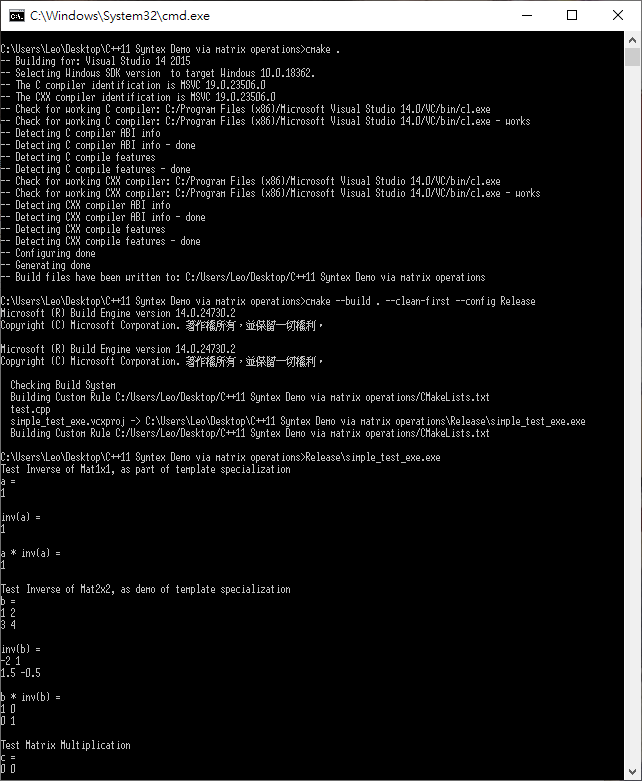
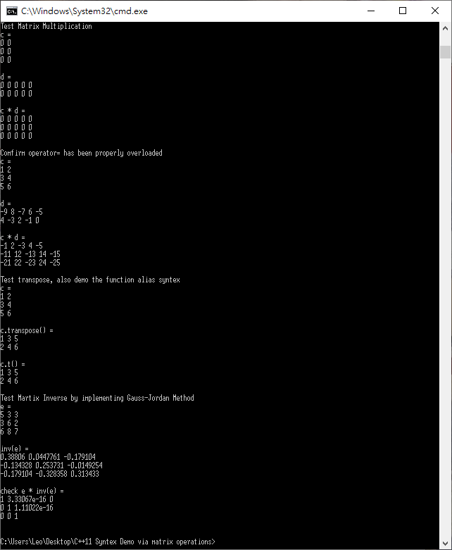

# C-11-Syntex-Demo-via-matrix-operations

## C++11 Syntex Demo via implementing matrix operations, compilation using Visual Studio 2015 and cmake

The following syntex / idiom / skills are included
1. Named Constructor idiom
2. C++ template, as well as default template parameter, non-type parameter
3. C++11 *std::initializer_list* usage, in both constructor and operator new
4. C++11 *std::unique_ptr* usage
5. C++ functor
6. C++11 trailing return type
7. C++11 *std::function*
8. C++11 type alias *using*
9. C++ template specialization as speed-up
10. C++11 explicit specifier

Execution is under Windows 10

### No External library required !!!
